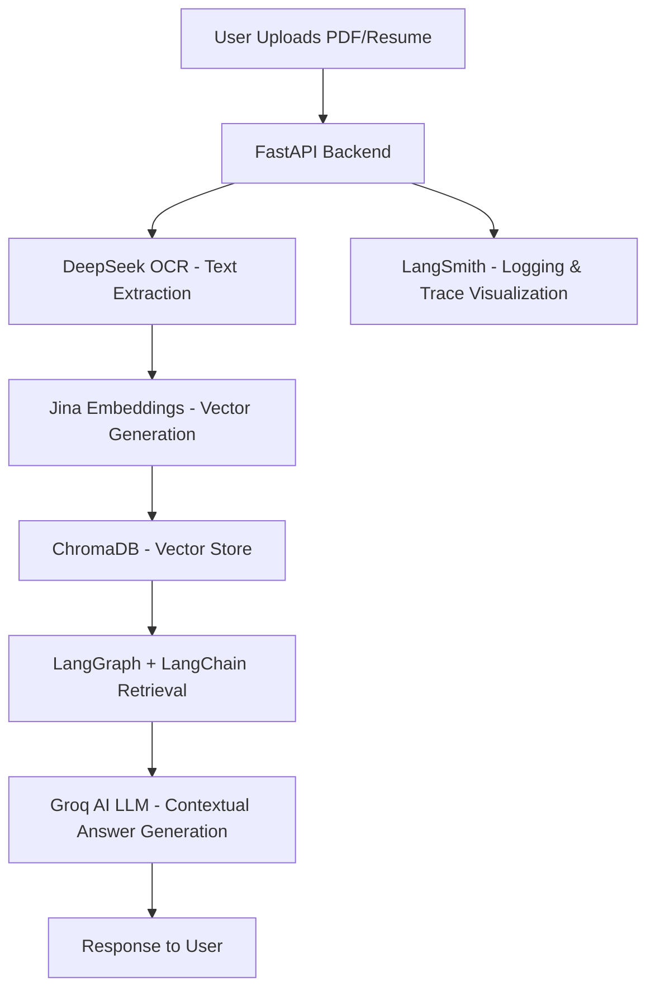

# 🧠 RAG-Powered PDF + Resume Chatbot

Ask domain-specific or resume-related questions directly from uploaded PDFs — with full user authentication, persistent memory, and LLM-driven intelligence.

---

## 🚀 Overview

This system is a **Retrieval-Augmented Generation (RAG)** chatbot built with **LangGraph**, **LangChain**, **LangSmith**, **FastAPI**, and **Groq AI**.  
Each authenticated user can upload PDFs (including resumes), which are automatically processed for semantic understanding and contextual Q&A.

The pipeline performs:
1. **Extraction** → Parses and reads documents using **DeepSeek OCR**
2. **Chunking & Embedding** → Converts text into dense vectors using **Jina Embeddings**
3. **Storage** → Saves embeddings in a persistent **ChromaDB** vector store
4. **Retrieval + Generation** → Uses **Groq AI** models via **LangGraph** for intelligent, grounded answers

---

## ✨ Core Features

- 🔐 **User Authentication** (JWT-based)
- 🔑 **Google OAuth Login**
- 📁 **Isolated User Folders** — each user's documents are stored independently
- 📄 **Automatic Resume Parsing + Semantic Understanding**
- 🧠 **RAG Q&A** — contextual question-answering over user documents
- 💬 **Chat Session Persistence** (MongoDB)
- 🔍 **Embeddings with Jina**
- 🧾 **Vector Inspection & Debug Endpoints**
- 📊 **Workflow Logging & Tracing with LangSmith**
- 🔗 **Graph-based Agent Orchestration using LangGraph**

---

## 🧩 Architecture Graph



---

## 🛠️ Tech Stack

| Layer                    | Tools                         |
| ------------------------ | ----------------------------- |
| **Backend**              | FastAPI, LangGraph, LangChain |
| **Embeddings**           | Jina                          |
| **Vector Store**         | ChromaDB                      |
| **OCR & Resume Parsing** | DeepSeek OCR                  |
| **LLM**                  | Groq AI                       |
| **Database**             | MongoDB                       |
| **Auth**                 | JWT, Google OAuth2            |
| **Monitoring**           | LangSmith                     |
| **Frontend (optional)**  | React                         |
| **Deployment**           | Uvicorn / Gunicorn            |

---

## 📂 Project Structure

```
project/
│
├── backend/
│   ├── main.py               # FastAPI entry point
│   ├── routes/
│   │   ├── auth.py           # JWT + Google OAuth
│   │   ├── upload.py         # File uploads
│   │   └── chat.py           # Q&A endpoints
│   ├── core/
│   │   ├── langgraph_chain.py # LangGraph + LangChain orchestration
│   │   ├── embeddings.py      # Jina embeddings + Chroma integration
│   │   └── resume_parser.py   # DeepSeek OCR for parsing resumes
│   └── utils/
│       ├── logger.py          # LangSmith trace + logging integration
│       └── db.py              # MongoDB + Chroma connections
│
├── frontend/ (optional)
│   ├── src/
│   └── public/
│
├── docs/
│   └── {username}/            # User-isolated uploads
│
├── chroma_db/                 # Vector storage
├── .env
├── requirements.txt
└── README.md
```

---

## 🌐 API Endpoints

| Endpoint             | Method | Description                      |
| -------------------- | ------ | -------------------------------- |
| `/api/register`      | POST   | Register a new user              |
| `/api/login`         | POST   | Login via email/password         |
| `/login/google`      | GET    | Google OAuth Login               |
| `/upload/{username}` | POST   | Upload PDF or Resume             |
| `/ask/{username}`    | POST   | Ask a question about user's docs |
| `/debug_chroma`      | GET    | Inspect vector database          |
| `/api/sessions`      | GET    | Retrieve chat session history    |

---

## 📝 Example Usage

### Request
```bash
POST /ask/shusmit
Content-Type: application/json

{
  "question": "Summarize candidate skills from the uploaded resume."
}
```

### Response
```json
{
  "answer": "The candidate demonstrates strong proficiency in Python, SQL, and data analysis, with experience in FastAPI and LangChain-based systems.",
  "context": ["... relevant text snippets from the resume ..."],
  "session_id": "674ad0b21a..."
}
```

---

## 🚀 Getting Started

### Prerequisites
- Python 3.9+
- MongoDB
- API keys for:
  - Groq AI
  - Jina Embeddings
  - DeepSeek OCR
  - Google OAuth (optional)

### Installation

1. Clone the repository:
```bash
git clone https://github.com/<your_username>/<your_repo_name>.git
cd <your_repo_name>
```

2. Install dependencies:
```bash
pip install -r requirements.txt
```

3. Set up environment variables in `.env`:
```env
GROQ_API_KEY=your_groq_key
JINA_API_KEY=your_jina_key
DEEPSEEK_API_KEY=your_deepseek_key
MONGODB_URI=your_mongodb_connection_string
GOOGLE_CLIENT_ID=your_google_client_id
GOOGLE_CLIENT_SECRET=your_google_client_secret
SECRET_KEY=your_jwt_secret
```

4. Run the application:
```bash
uvicorn backend.main:app --reload
```

5. Access the API at `http://localhost:8000`

---

## 📚 Documentation

For detailed API documentation, visit `/docs` (Swagger UI) or `/redoc` (ReDoc) after starting the server.

---

## 🤝 Contributing

Contributions are welcome! Please feel free to submit a Pull Request.

---

## 📄 License

This project is licensed under the MIT License - see the LICENSE file for details.

---

## ❤️ Credits

**Developed by Shusmit Sarkar**

Built using:
- [LangGraph](https://github.com/langchain-ai/langgraph)
- [LangChain](https://github.com/langchain-ai/langchain)
- [LangSmith](https://smith.langchain.com/)
- [FastAPI](https://fastapi.tiangolo.com/)
- [ChromaDB](https://www.trychroma.com/)
- [Jina Embeddings](https://jina.ai/)
- [Groq AI](https://groq.com/)
- [DeepSeek OCR](https://deepseek.com/)

---

**⭐ If you find this project useful, please consider giving it a star!**
